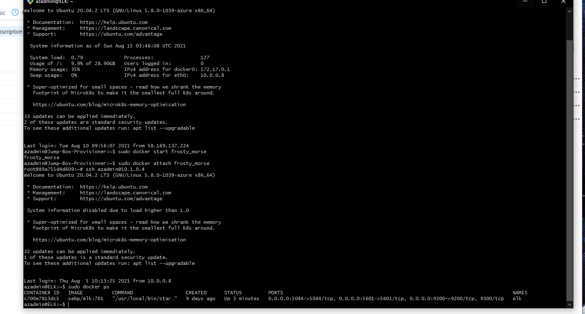

## Automated ELK Stack Deployment

The files in this repository were used to configure the network depicted below.

**Note**: The following image link needs to be updated. Replace `diagram_filename.png` with the name of your diagram image file.  

These files have been tested and used to generate a live ELK deployment on Azure. They can be used to either recreate the entire deployment pictured above. Alternatively, select portions of the scripts file may be used to install only certain pieces of it, such as Filebeat.

  - hosts file [here](./Scripts/hosts)
  - ELK-install [here](./Scripts/install-elk.yml)
  - filebeat-config [here](./Scripts/filebeat-config.yml)
  - filebeat-playbook [here](./Scripts/filebeat-playbook.yml)
  - metricbeat-config [here](./Scripts/metricbeat-config.yml)
  - metricbeat-playbook [here](./Scripts/metricbeat-playbook.yml)

This document contains the following details:
- Description of the Topologu
- Access Policies
- ELK Configuration
  - Beats in Use
  - Machines Being Monitored
- How to Use the Ansible Build

### Description of the Topology

The main purpose of this network is to expose a load-balanced and monitored instance of DVWA, the D*mn Vulnerable Web Application.

Load balancing ensures that the application will be highly available, in addition to restricting access to the network.
- Load-balancer protect organisation from DDoS attacks ensuring hiher aviabiliy.

Integrating an ELK server allows users to easily monitor the vulnerable VMs for changes to the metric and system logs.
- Filebeat is a lightweight shipper for forwarding and centralizing log data. Installed as an agent on your servers, Filebeat monitors the log files or locations that you specify, collects log events, and forwards them either to Elasticsearch or Logstash for indexing.
- Metricbeat is a lightweight shipper that you can install on your servers to periodically collect metrics from the operating system and from services running on the server. Metricbeat takes the metrics and statistics that it collects and ships them to the output that you specify, such as Elasticsearch or Logstash.

The configuration details of each machine may be found below.
_Note: Use the [Markdown Table Generator](http://www.tablesgenerator.com/markdown_tables) to add/remove values from the table_.

| Name                  | Function              | IP Address       | Operating System |
|-----------------------|-----------------------|------------------|------------------|
| Jump-Box_priviosner   | Gateway               | 10.X.X.X         | Linux            |
| Web-1                 | Docker/DVWA           | 10.X.X.X         | Linux            |
| Web-2                 | Docker/DVWA           | 10.X.X.XX        | Linux            |
| ELK                   | ELK stack             | 10.1.X.X         | Linux            |

### Access Policies

The machines on the internal network are not exposed to the public Internet. 

Only the Jump-Box_priviosner machine can accept connections from the Internet. Access to this machine is only allowed from the following IP addresses:
- 58.167.192.184

Machines within the network can only be accessed by the Jump-Box_provisioner.
- The ELK VM can be access by two machine: the Jump-box_provisioner via the Ansible docker container and the IP is 10.X.X.X , adn my remote workstaion 58.XXX.XXX.XXX.

A summary of the access policies in place can be found in the table below.

| Name     | Publicly Accessible | Allowed IP Addresses                             |
|----------|---------------------|--------------------------------------------------|
| Jump-Box-Provisioner Box       | Yes                 | 58.XXX.XXX.XXX             |
| Web-1                          | No                  | 10.X.X.X                   |
| Web-2                          | No                  | 10.X.X.X                   |
| ELK                            | Yes                 | 58.XXX.XXX.XXX / 10.X.X.X  |

### Elk Configuration

Ansible was used to automate configuration of the ELK machine. No configuration was performed manually, which is advantageous because...
- The infrastructure and application can be recreated on any VM in a faster way

The playbook implements the following tasks:
- Install docker on ELK VM
- Install python pip3
- Install docker python module
- Increase memory use to 262144
- Download and launch docker elk container (sebp/elk:761) and configure port 5601,9200,5044
- ensure docker service and container run at startup

The following screenshot displays the result of running `docker ps` after successfully configuring the ELK instance.

**Note**: The following image link needs to be updated. Replace `docker_ps_output.png` with the name of your screenshot image file.  

### Target Machines & Beats
This ELK server is configured to monitor the following machines:
- 10.X.X.X Web-1
- 10.X.X.X Web-2

We have installed the following Beats on these machines:
- filebeat
- metricbeat

These Beats allow us to collect the following information from each machine:
- The system Filebeat module collects and parses log created by the system and logging service of Common Linux distribution
- The docker Metricbeat collect metrics from the Docker containers. Default metrics are: container,cpu,diskio, healthcheck, info, memory and network.

### Using the Playbook
In order to use the playbook, you will need to have an Ansible control node already configured. Assuming you have such a control node provisioned: 

SSH into the control node and follow the steps below:
- Copy the Ansible playbook file to /etc/ansible.
- Update the host file to include the new VM
- Run the playbook, and navigate to http://your.VM.IP:5601/app/kibana to check that the installation worked as expected.

_TODO: Answer the following questions to fill in the blanks:_
- _Which file is the playbook?
 - install-elk.yml
- _Where do you copy it?_
 - /etc/ansible
- _Which file do you update to make Ansible run the playbook on a specific machine?_
 - yml playbook
How do I specify which machine to install the ELK server on versus which to install Filebeat on?_
 - Hosts file
- _Which URL do you navigate to in order to check that the ELK server is running?_
 - http://your.VM.IP:5601/app/kibana

_As a **Bonus**, provide the specific commands the user will need to run to download the playbook, update the files, etc._
